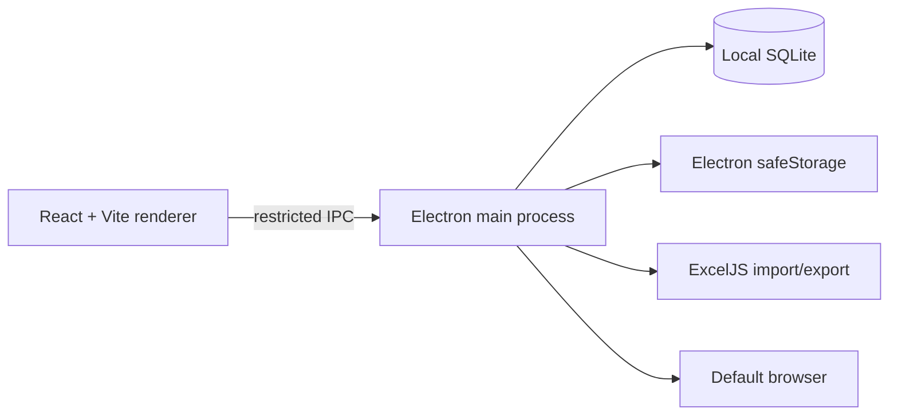

# Auto Login

**English** · [简体中文](README.md) · [繁體中文](README.zh-TW.md)

Auto Login is a Windows desktop application for managing website entries, accounts, groups, and login pages locally. It securely opens approved login URLs in the system default browser.

> Passwords remain in a local SQLite database and are encrypted with the operating system's secure storage when available. Never commit real credentials, databases, or exported spreadsheets.

## Features

- Manage sites, accounts, passwords, login pages, groups, and notes
- Import, preview, map, and export site records with Excel
- Search, paginate, filter by group, and open login pages in batches
- Keep data local; no mandatory cloud service is used
- Build Windows directory, installer, and portable editions

## Architecture



## Stack

| Layer | Technology |
| --- | --- |
| Desktop runtime | Electron 43 |
| UI | React 19, Vite 6 |
| Local data | Node.js SQLite (`node:sqlite`) |
| Excel | ExcelJS |
| Quality | ESLint, Node.js Test Runner, GitHub Actions |

## Repository structure

```text
Auto-Login/
├─ .github/
│  ├─ ISSUE_TEMPLATE/              # Bug and feature-request templates
│  ├─ workflows/release.yml        # Validation, secret scan, Windows release
│  ├─ dependabot.yml
│  └─ pull_request_template.md
├─ scripts/                        # Development and optional Playwright scripts
├─ src/
│  ├─ main/                        # Electron main process, SQLite, Excel, security
│  │  ├─ app/                      # Application metadata
│  │  └─ services/passwordVault/   # Local password-vault helpers
│  ├─ preload/                     # Restricted IPC bridge
│  ├─ renderer/                    # React UI and styles
│  └─ shared/                      # Cross-process rules and utilities
├─ tests/                          # Node.js automated tests and fixtures
├─ BUILDING.md                     # Windows build guide
├─ CHANGELOG.md                    # Change history
├─ CONTRIBUTING.md                 # Contribution guide
├─ SECURITY.md                     # Security policy
├─ package.json                    # Scripts, dependencies, electron-builder config
└─ vite.config.js                  # Vite configuration
```

`node_modules/`, `dist/`, `release/`, local databases, and runtime output are generated locally and excluded by `.gitignore`; they are not source directories.

## Getting started

### Requirements

- Windows 10/11 x64
- Node.js 22 LTS (`>=22 <23`)

```powershell
git clone https://github.com/AptimLvStic/Auto-Login.git
cd Auto-Login
npm ci
npm run dev
```

The SQLite database is created automatically under Electron's `userData` directory, not inside the repository.

## Commands

| Command | Purpose |
| --- | --- |
| `npm run dev` | Start development mode |
| `npm run lint` | Run linting |
| `npm test` | Run automated tests |
| `npm run build` | Build the renderer |
| `npm run pack:win:dir` | Create an unpacked Windows build |
| `npm run pack:win` | Create unpacked, installer, and portable builds |

```powershell
npm ci
npm run lint
npm test
npm run build
npm audit --audit-level=high
```

See [BUILDING.md](BUILDING.md) for supported Node.js versions, restricted-network builds, and local packaging guidance.

## Excel import

Download the template from the app or import an `.xlsx` file with these required fields: site name, site URL, username, password, username selector, password selector, and submit selector. The UI previews headers and supports field mapping before import.

Only `http` and `https` URLs are accepted.

## Optional Playwright workflow

The repository includes a standalone browser-login runner for authorized testing and internal systems:

```powershell
npm install -D playwright
npx playwright install chromium
npm run playwright:login:example
```

Copy [scripts/playwright-login.example.json](scripts/playwright-login.example.json), replace it with sanitized test credentials and selectors, then run:

```powershell
npm run playwright:login -- --config path/to/login-workflow.json
```

Use this capability only for systems you are authorized to access. Protect workflow configuration files and generated screenshots.

## Security

- Electron uses context isolation, sandboxing, and a minimal IPC bridge.
- Navigation, pop-up windows, and permission requests are blocked; only HTTP/HTTPS external URLs can be opened.
- Passwords prefer Electron `safeStorage`; a compatibility fallback is not a boundary against a local privileged attacker.
- Sign Windows installers with a trusted code-signing certificate before public distribution.

Read [SECURITY.md](SECURITY.md) for the supported scope and responsible disclosure process.

## CI and releases

Pushes to `main` and pull requests run dependency installation, linting, tests, builds, high-severity dependency auditing, and secret scanning in GitHub Actions.

To publish:

```powershell
# Update package.json and CHANGELOG.md first.
git tag vX.Y.Z
git push origin vX.Y.Z
```

The tag workflow builds on a GitHub Windows Runner, uploads installer and portable assets, and creates a GitHub Release. Download current builds from [Releases](https://github.com/AptimLvStic/Auto-Login/releases).

## Contributing

Run the quality checks before opening a pull request. Do not commit `node_modules`, build output, local databases, real credentials, exported spreadsheets, or screenshots. See [CONTRIBUTING.md](CONTRIBUTING.md).

## License

No open-source license is currently declared. Contact the maintainer before reusing, distributing, or contributing code.
