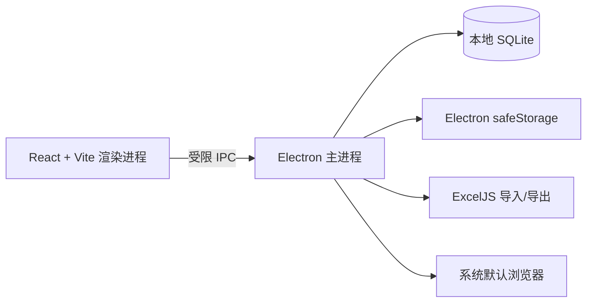

# Auto Login

[English](README.en.md) · [繁體中文](README.zh-TW.md) · **简体中文**

Auto Login 是一款面向 Windows 的本地桌面应用，用于集中管理网站入口、账号、分组与登录页面，并在系统默认浏览器中安全地打开登录页。

> 密码仅存储在本机 SQLite 数据库中，并优先使用操作系统安全存储加密。请勿将真实凭据、数据库或导出的表格提交到仓库。

## 功能

- 管理站点、账号、密码、登录页、分组和备注
- 通过 Excel 导入、预览、字段映射与导出站点数据
- 搜索、分页、分组筛选和批量打开登录页
- 在隔离登录窗口中等待表单、自动填写账号密码并提交
- 本地加密保存密码，不向任何云端服务上传数据
- 构建 Windows 目录版、安装版和便携版

## 架构



## 技术栈

| 层级 | 技术 |
| --- | --- |
| 桌面运行时 | Electron 43 |
| 用户界面 | React 19、Vite 6 |
| 本地数据 | Node.js SQLite (`node:sqlite`) |
| Excel | ExcelJS |
| 质量保障 | ESLint、Node.js Test Runner、GitHub Actions |

## 目录结构

```text
Auto-Login/
├─ .github/
│  ├─ ISSUE_TEMPLATE/              # Bug 与功能请求模板
│  ├─ workflows/release.yml        # 验证、密钥扫描与 Windows 发布
│  ├─ dependabot.yml
│  └─ pull_request_template.md
├─ scripts/                        # 开发与可选 Playwright 工作流脚本
├─ src/
│  ├─ main/                        # Electron 主进程、SQLite、Excel 与安全策略
│  │  ├─ app/                      # 应用元信息
│  │  └─ services/passwordVault/   # 本地密码库辅助逻辑
│  ├─ preload/                     # 受限 IPC 桥接层
│  ├─ renderer/                    # React 页面与样式
│  └─ shared/                      # 前后进程共用规则与工具
├─ tests/                          # Node.js 自动化测试与测试夹具
├─ BUILDING.md                     # Windows 构建指南
├─ CHANGELOG.md                    # 变更记录
├─ CONTRIBUTING.md                 # 贡献指南
├─ SECURITY.md                     # 安全策略
├─ package.json                    # 脚本、依赖和 electron-builder 配置
└─ vite.config.js                  # Vite 配置
```

`node_modules/`、`dist/`、`release/`、本地数据库和运行输出均为本机生成文件，已由 `.gitignore` 排除，不属于源码目录结构。

## 快速开始

### 环境要求

- Windows 10/11 x64
- Node.js 22 LTS（`>=22 <23`）

```powershell
git clone https://github.com/AptimLvStic/Auto-Login.git
cd Auto-Login
npm ci
npm run dev
```

应用启动后，本地数据库会自动创建在 Electron 的 `userData` 目录中，而非项目目录。

## 常用命令

| 命令 | 用途 |
| --- | --- |
| `npm run dev` | 启动开发模式 |
| `npm run lint` | 执行代码规范检查 |
| `npm test` | 运行自动化测试 |
| `npm run build` | 构建前端资源 |
| `npm run pack:win:dir` | 生成 Windows 目录版 |
| `npm run pack:win` | 生成目录版、安装版和便携版 |

执行完整的本地质量检查：

```powershell
npm ci
npm run lint
npm test
npm run build
npm audit --audit-level=high
```

有关 Node.js 版本、网络受限构建和本地打包说明，请参阅 [BUILDING.md](BUILDING.md)。

## Excel 导入

在应用中下载模板，或使用包含以下必填字段的 `.xlsx` 文件：站点名称、站点地址、账号、密码、账号输入框 Selector、密码输入框 Selector、提交按钮 Selector。导入前可在界面中预览表头并完成字段映射。

仅允许 `http` 与 `https` 站点地址；其他协议会被拒绝。点击“自动登录”后，应用会在独立的受沙箱保护窗口中等待填写所需的三个 Selector、代填账号密码并点击提交。若 Selector 不匹配或页面加载超时，窗口会保留，方便手动继续操作。

## Playwright 登录工作流（可选）

项目提供独立的自动化登录脚本，适用于获得明确授权的测试或内部系统：

```powershell
npm install -D playwright
npx playwright install chromium
npm run playwright:login:example
```

复制 [scripts/playwright-login.example.json](scripts/playwright-login.example.json)，替换为脱敏的测试凭据与选择器后运行：

```powershell
npm run playwright:login -- --config path/to/login-workflow.json
```

请仅对有权访问的系统使用此功能，并妥善保护配置文件和生成的截图。

## 安全说明

- Electron 使用 `contextIsolation`、沙箱和最小化 IPC API。
- 应用阻止窗口任意跳转、弹窗创建与权限请求，并只允许打开 HTTP/HTTPS 外链。
- 密码优先由 Electron `safeStorage` 加密；安全存储不可用时会使用兼容性回退方案。该回退方案不用于抵御本机高权限攻击者。
- 请在公开分发前使用可信 Windows 代码签名证书签名安装包。

漏洞报告与支持范围见 [SECURITY.md](SECURITY.md)。

## CI 与发布

推送到 `main` 或创建 Pull Request 时，GitHub Actions 会执行安装、Lint、测试、构建、依赖高危漏洞审计与密钥扫描。

发布新版本：

```powershell
# 先更新 package.json 与 CHANGELOG.md
git tag vX.Y.Z
git push origin vX.Y.Z
```

标签构建会在 GitHub Windows Runner 上生成安装版和便携版，并自动创建 GitHub Release。当前版本可在 [Releases](https://github.com/AptimLvStic/Auto-Login/releases) 下载。

## 贡献

提交前请运行质量检查，并避免提交 `node_modules`、构建产物、本地数据库、真实凭据、导出表格与截图。详细流程请参阅 [CONTRIBUTING.md](CONTRIBUTING.md)。

## 许可证

当前仓库尚未声明开源许可证；在复用、分发或贡献前请先联系维护者确认授权范围。
