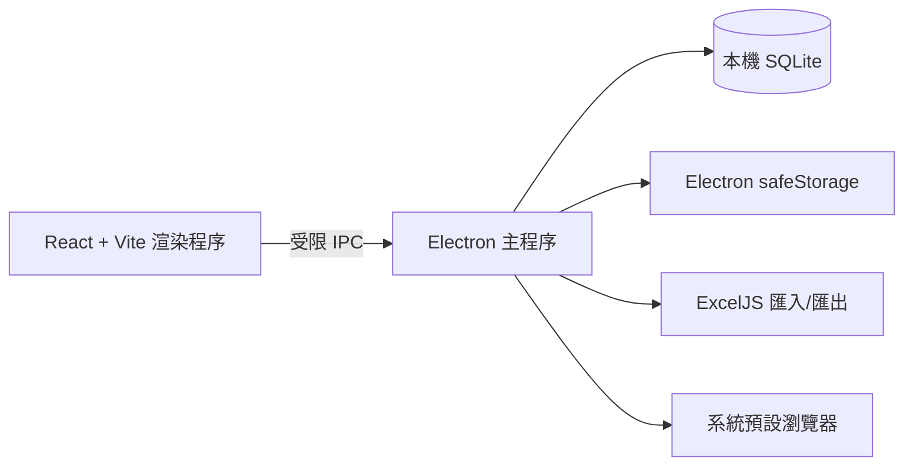

# Auto Login

[English](README.en.md) · [简体中文](README.md) · **繁體中文**

Auto Login 是一款 Windows 本機桌面應用程式，用於集中管理網站入口、帳號、群組與登入頁面，並在系統預設瀏覽器中安全地開啟登入頁。

> 密碼只會儲存在本機 SQLite 資料庫，且優先使用作業系統安全儲存加密。請勿將真實憑證、資料庫或匯出的試算表提交到儲存庫。

## 功能

- 管理網站、帳號、密碼、登入頁、群組與備註
- 透過 Excel 匯入、預覽、欄位對應與匯出網站資料
- 搜尋、分頁、群組篩選與批次開啟登入頁
- 在隔離登入視窗中等候表單、自動填寫帳號密碼並提交
- 資料保留在本機，不需要雲端服務
- 建置 Windows 目錄版、安裝版與可攜版

## 架構



## 技術棧

| 層級 | 技術 |
| --- | --- |
| 桌面執行環境 | Electron 43 |
| 使用者介面 | React 19、Vite 6 |
| 本機資料 | Node.js SQLite (`node:sqlite`) |
| Excel | ExcelJS |
| 品質保證 | ESLint、Node.js Test Runner、GitHub Actions |

## 目錄結構

```text
Auto-Login/
├─ .github/
│  ├─ ISSUE_TEMPLATE/              # Bug 與功能請求範本
│  ├─ workflows/release.yml        # 驗證、密鑰掃描與 Windows 發行
│  ├─ dependabot.yml
│  └─ pull_request_template.md
├─ scripts/                        # 開發及選用的 Playwright 工作流程指令碼
├─ src/
│  ├─ main/                        # Electron 主程序、SQLite、Excel 與安全策略
│  │  ├─ app/                      # 應用程式中繼資料
│  │  └─ services/passwordVault/   # 本機密碼庫輔助邏輯
│  ├─ preload/                     # 受限 IPC 橋接層
│  ├─ renderer/                    # React 介面與樣式
│  └─ shared/                      # 跨程序共用規則與工具
├─ tests/                          # Node.js 自動化測試與測試夾具
├─ BUILDING.md                     # Windows 建置指南
├─ CHANGELOG.md                    # 變更記錄
├─ CONTRIBUTING.md                 # 貢獻指南
├─ SECURITY.md                     # 安全策略
├─ package.json                    # 指令、依賴與 electron-builder 設定
└─ vite.config.js                  # Vite 設定
```

`node_modules/`、`dist/`、`release/`、本機資料庫及執行輸出都是本機產生檔案，已由 `.gitignore` 排除，不屬於原始碼目錄結構。

## 快速開始

### 環境需求

- Windows 10/11 x64
- Node.js 22 LTS（`>=22 <23`）

```powershell
git clone https://github.com/AptimLvStic/Auto-Login.git
cd Auto-Login
npm ci
npm run dev
```

SQLite 資料庫會自動建立於 Electron 的 `userData` 目錄，而不是專案目錄。

## 常用指令

| 指令 | 用途 |
| --- | --- |
| `npm run dev` | 啟動開發模式 |
| `npm run lint` | 執行程式碼規範檢查 |
| `npm test` | 執行自動化測試 |
| `npm run build` | 建置前端資源 |
| `npm run pack:win:dir` | 產生 Windows 目錄版 |
| `npm run pack:win` | 產生目錄版、安裝版與可攜版 |

```powershell
npm ci
npm run lint
npm test
npm run build
npm audit --audit-level=high
```

Node.js 版本、受限網路建置及本機封裝說明請見 [BUILDING.md](BUILDING.md)。

## Excel 匯入

可在應用程式中下載範本，或匯入含有下列必填欄位的 `.xlsx`：網站名稱、網站網址、帳號、密碼、帳號輸入框 Selector、密碼輸入框 Selector、提交按鈕 Selector。匯入前可預覽表頭並完成欄位對應。

僅接受 `http` 與 `https` 網址。點選「自動登入」後，應用程式會在獨立的沙箱保護視窗中等候三個已設定的 Selector、代填帳號密碼並點擊提交。若 Selector 不符或頁面載入逾時，視窗會保留以便手動繼續操作。

## Playwright 登入工作流程（選用）

專案提供獨立的瀏覽器登入腳本，僅適用於已取得授權的測試或內部系統：

```powershell
npm install -D playwright
npx playwright install chromium
npm run playwright:login:example
```

複製 [scripts/playwright-login.example.json](scripts/playwright-login.example.json)，以去識別化的測試憑證與選擇器取代內容後執行：

```powershell
npm run playwright:login -- --config path/to/login-workflow.json
```

請只對您獲得授權的系統使用此功能，並妥善保護工作流程設定與產生的截圖。

## 安全性

- Electron 使用內容隔離、沙箱與最小化 IPC API。
- 應用程式封鎖任意導覽、彈出視窗與權限請求，且僅允許開啟 HTTP/HTTPS 外部網址。
- 密碼優先使用 Electron `safeStorage` 加密；相容性回退方案無法防禦本機高權限攻擊者。
- 公開散布前，請使用可信任的 Windows 程式碼簽署憑證簽署安裝程式。

支援範圍與漏洞通報流程請見 [SECURITY.md](SECURITY.md)。

## CI 與發行

推送至 `main` 或建立 Pull Request 時，GitHub Actions 會執行依賴安裝、Lint、測試、建置、高風險依賴稽核與密鑰掃描。

發行新版本：

```powershell
# 請先更新 package.json 與 CHANGELOG.md。
git tag vX.Y.Z
git push origin vX.Y.Z
```

標籤工作流程會在 GitHub Windows Runner 建置安裝版和可攜版，並自動建立 GitHub Release。請從 [Releases](https://github.com/AptimLvStic/Auto-Login/releases) 下載最新版本。

## 貢獻

建立 Pull Request 前請執行品質檢查。請勿提交 `node_modules`、建置產物、本機資料庫、真實憑證、匯出表格或截圖。詳情請見 [CONTRIBUTING.md](CONTRIBUTING.md)。

## 授權

目前儲存庫尚未宣告開源授權條款。重用、散布或貢獻程式碼前，請先與維護者確認授權範圍。
